# Using Combined Actions

> * Level: Beginner
>
> * Reading Time: 5 minutes
>
> * Checked with: Unity 2018.3.14f1

## Introduction

Combined Actions allow for more complex input types and in this guide we'll look at how to use Boolean input such as keyboard keys to mimic an analogue axis such as a thumbstick.

We can then take this sort of axis data and convert it into movement information or rotation information for other objects in our scene.

## Prerequisites

* [Install the Tilia.Input.UnityInputManager.Unity] package dependency in to your [Unity] project.
* [Install the Tilia.Input.CombinedActions.Unity] package dependency in to your Unity project.

## Let's Start

### Step 1

Create a new `Capsule` Unity 3D Object by selecting `Main Menu -> GameObject -> 3D Object -> Capsule`:

Right click on the `Capsule` GameObject, select `3D Object -> Cube` and change the Transform properties to:

* Position: `X = 0, Y = 0.9, Z = 0.25`
* Scale: `X = 0.1, Y = 0.1, Z = 1`

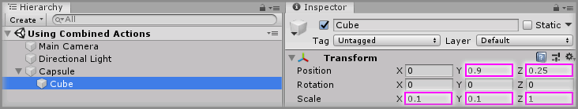

### Step 2

Add a `Input.UnityInputManager.ButtonAction` prefab to the Unity project hierarchy by selecting `GameObject -> Tilia -> Prefabs -> Input -> UnityInputManager -> Input.UnityInputManager.ButtonAction` from the Unity main top menu.

Set the `Key Code` property in the `Unity Input Manager Button Action` component to `W`.

> To make it easier you could rename `Input.UnityInputManager.ButtonAction` GameObject to `Input.UnityInputManager.ButtonAction W` as we will have 4 different total button actions.

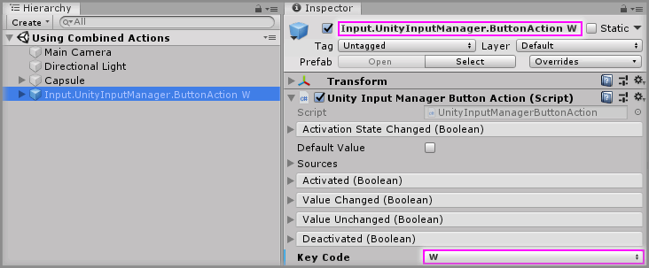

> Repeat this 3 more times for the keys A, S and D.

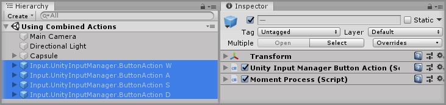

### Step 3

Add a `Input.CombinedActions.BooleanTo1DAxisAction` prefab to the Unity project hierarchy by selecting `GameObject -> Tilia -> Prefabs -> Input -> CombinedActions -> Input.CombinedActions.BooleanTo1DAxisAction` from the Unity main top menu.

Rename the newly created `Input.CombinedActions.BooleanTo1DAxisAction` GameObject to `Input.CombinedActions.BooleanTo1DAxisAction Horizontal`

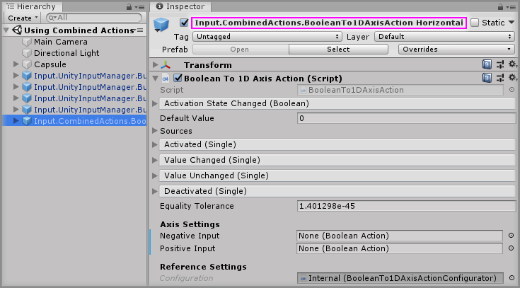

### Step 4

In the Axis Settings on the `Boolean To 1DAxis Action` component of the `Boolean To 1DAxis Action Horizontal` GameObject, drag and drop the `Input.UnityInputManager.ButtonAction A` GameObject into the `Negative Input` property and drag and drop the `Input.UnityInputManager.ButtonAction D` GameObject into the `Positive Input` property.

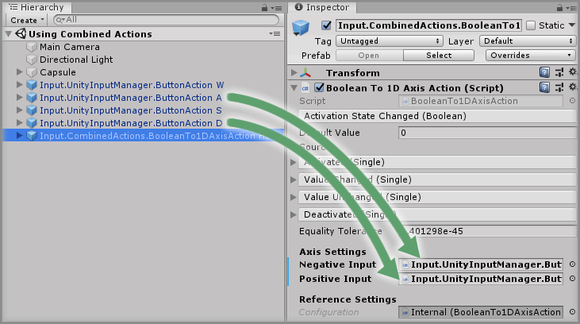

### Step 5

Drag and drop another `Input.CombinedActions.BooleanTo1DAxisAction` prefab into the Unity Hierarchy window. Rename the new `Input.CombinedActions.BooleanTo1DAxisAction` GameObject to `Input.CombinedActions.BooleanTo1DAxisAction Vertical`.

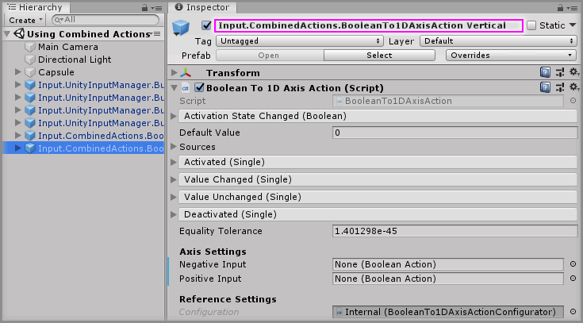

In the Axis Settings on the `Boolean To 1DAxis Action` component of the `Boolean To 1DAxis Action Vertical` GameObject, drag and drop the `Input.UnityInputManager.ButtonAction S` GameObject into the `Negative Input` property and drag and drop the `Input.UnityInputManager.ButtonAction W` GameObject into the `Positive Input` property.

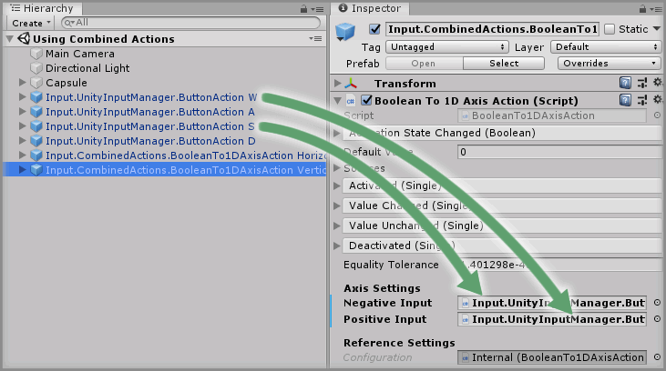

### Step 6

Create a new `Empty` Unity Object by selecting `Main Menu -> GameObject -> Create Empty` and rename it to `Movement`.

Click the `Add Component` button, then select `Transform Position Mutator` component.

This newly created `Transform Position Mutator` will be used to change the position of our `Capsule` based on our axis input.

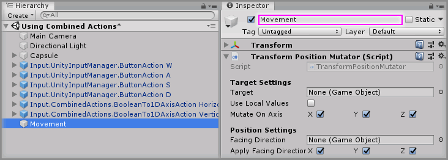

### Step 7

Drag and drop the `Capsule` GameObject into the `Target` property on the `Transform Position Mutator` component.

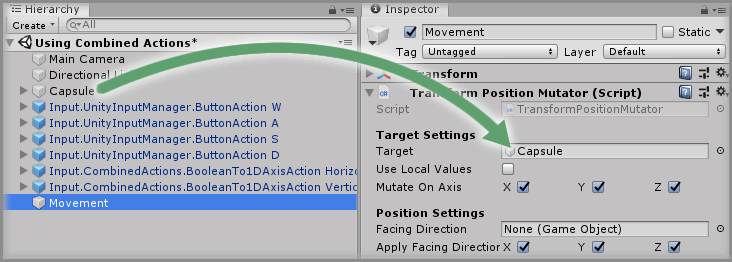

### Step 8

Add a `Input.CombinedActions.AxesToVector3Action` prefab to the Unity project hierarchy by selecting `GameObject -> Tilia -> Prefabs -> Input -> CombinedActions -> Input.CombinedActions.AxesToVector3Action` from the Unity main top menu.

### Step 9

Drag and drop the `Input.CombinedActions.BooleanTo1DAxisAction Horizontal` GameObject into the `Lateral Axis` property on the `Axes To Vector3` component within the `Input.CombinedActions.AxesToVector3Action` GameObject.

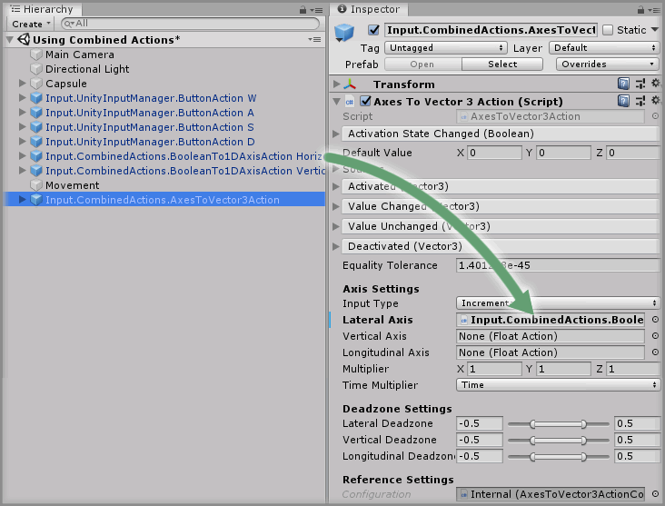

Drag and drop the `Input.CombinedActions.BooleanTo1DAxisAction Vertical` GameObject into the `Longitudinal Axis` property on the `Axes To Vector3 Action` component.

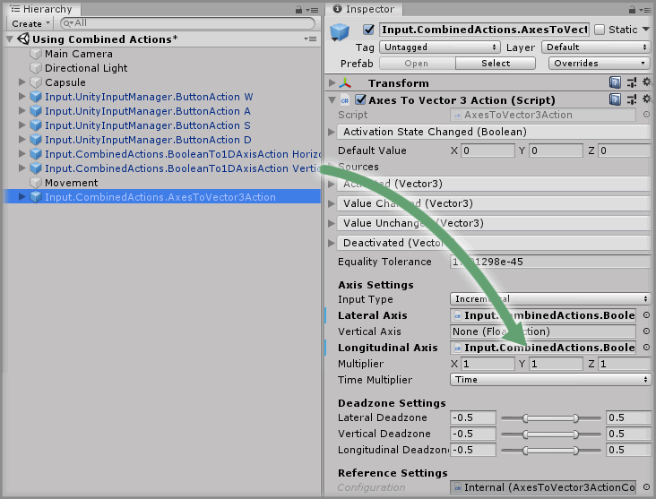

Change the `Time Multiplier` property to `Delta Time` on the `Axes To Vector3 Action` component.

> We want this to be `Delta Time` as we only want to multiply our axis values based on the time since the last update frame only, otherwise our movement speed would be too fast.

### Step 10

Select the `Input.CombinedActions.AxesToVector3Action` GameObject from the Unity Hierarchy window and click the `+` symbol in the bottom right corner of the `Value Changed` event parameter on the `Axes To Vector3 Action` component.

Drag and drop the `Movement` GameObject into the event listener box that appears on the `Value Changed` event parameter on the `Axes To Vector3 Action` component that displays `None (Object)`.

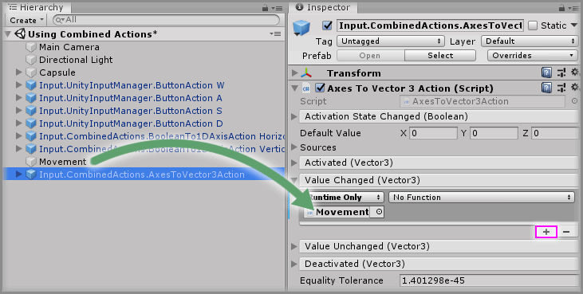

Select a function to perform when the `Value Changed` event is emitted. For this example, select the `TransformPositionMutator -> DoIncrementProperty` function (be sure to select `Dynamic Vector3 - DoIncrementProperty` for this example).

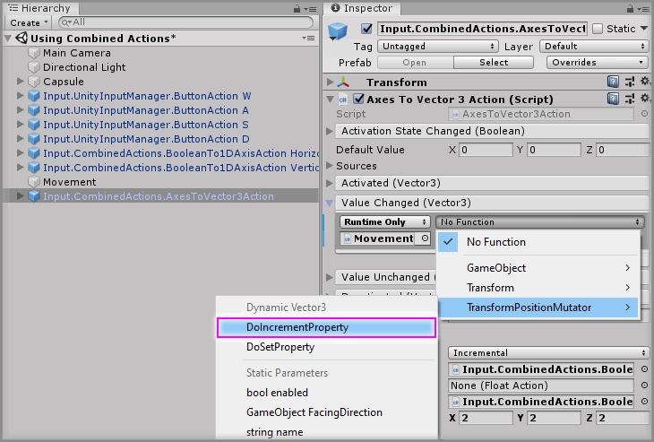

> Play the Unity scene you should now be able to control the GameObject using the W, A, S, D keys.

### Step 11

We are now going to make it possible to rotate the capsule instead.

Disable the `Movement` GameObject so our previously implemented movement functionality doesn't operate.

### Step 12

Create a new `Empty` Unity Object by selecting `Main Menu -> GameObject -> Create Empty` and rename it `Rotation`.

Click the `Add Component` button, then select `Float To Vector3` component.

This newly created `Float To Vector3` component will be used to pass a rotation angle in the form of a Euler angle to rotate our `Capsule`.

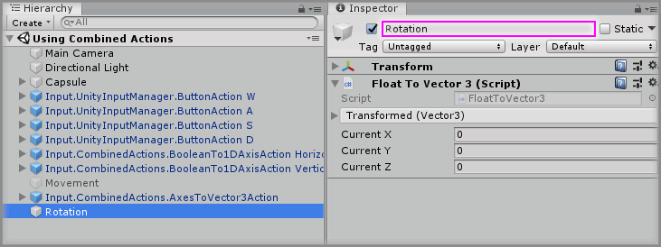

Click the `Add Component` button again, then select `Transform Euler Rotation Mutator` component.

This newly created `Transform Euler Rotation Mutator` component rotate our `Capsule` based on the rotation angle passed in from the `Float To Vector3` component.

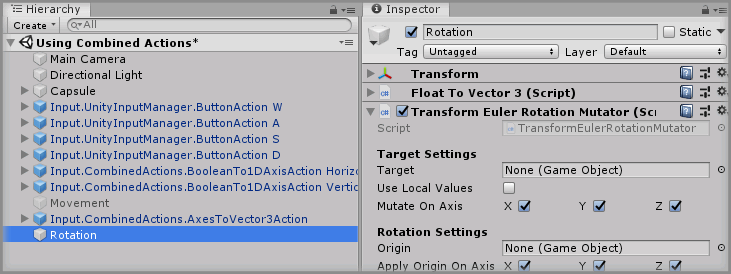

### Step 13

Drag and drop the `Capsule` GameObject into the `Target` property on the `Transform Euler Rotation Mutator` component.

Also, change the `Mutate on Axis` property and untick the `X` and `Z` checkboxes.

> The reason we only want the Y axis turned on is because we only want to rotate around this axis to make our capsule rotate to a new facing direction in the scene.

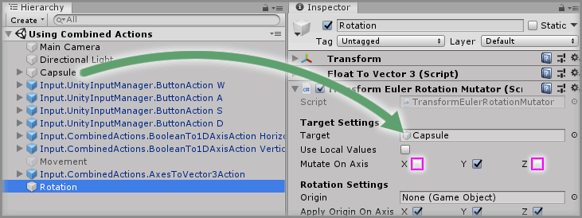

### Step 14

Select the `Rotation` GameObject from the Unity Hierarchy window and click the `+` symbol in the bottom right corner of the `Transformed` event parameter on the `Float To Vector3` component.

Drag and drop the `Rotation` GameObject into the event listener box that appears on the `Transformed` event parameter on the `Float To Vector3` component that displays `None (Object)`.

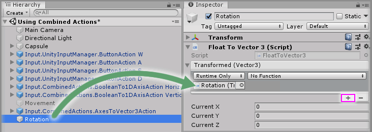

Select a function to perform when the `Value Changed` event is emitted. For this example, select the `TransformEulerRotationMutator -> DoSetProperty` function (be sure to select `Dynamic Vector3 - DoSetProperty` for this example).

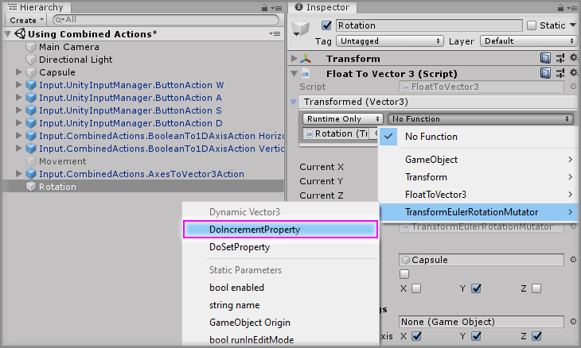

### Step 15

Add a `Input.CombinedActions.AxesToAngle` prefab to the Unity project hierarchy by selecting `GameObject -> Tilia -> Prefabs -> Input -> CombinedActions -> Input.CombinedActions.AxesToAngle` from the Unity main top menu.

### Step 16

On the `Input.CombinedActions.AxesToAngle` GameObject, Drag and drop the `Input.CombinedActions.BooleanTo1DAxisAction Vertical` GameObject into the `Vertical Axis` property on the `Axis To Angle Action` component.

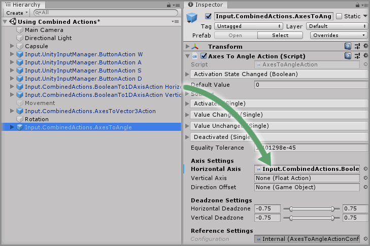

Drag and drop the `Input.CombinedActions.BooleanTo1DAxisAction Vertical` GameObject into the `Vertical Axis` property on the `Axis To Angle Action` component.

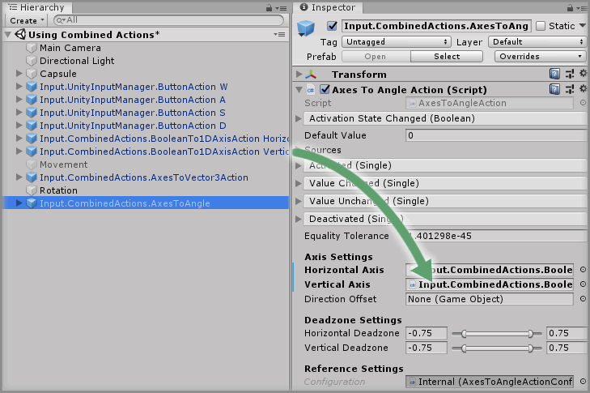

### Step 17

Select the `Input.CombinedActions.AxesToAngle` GameObject from the Unity Hierarchy window and click the `+` symbol in the bottom right corner of the `Value Changed` event parameter on the `Axes To Angle Action` component.

Drag and drop the `Rotation` GameObject into the event listener box that appears on the `Value Changed` event parameter on the `Axes To Angle Action` component that displays `None (Object)`.

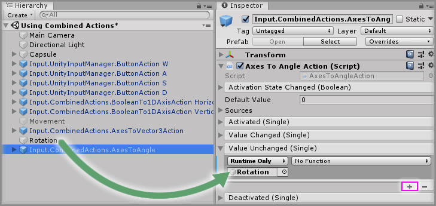

Select a function to perform when the `Value Changed` event is emitted. For this example, select the `Float To Vector3 -> CurrentY` function (be sure to select `Dynamic Vector3 - CurrentY` for this example).

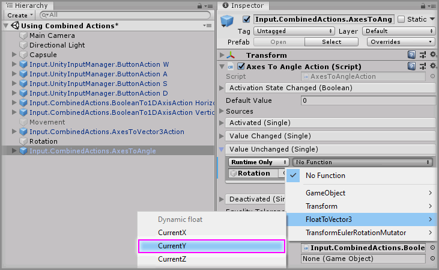

### Step 18

Select the `Input.CombinedActions.AxesToAngle` GameObject from the Unity Hierarchy window and click the `+` symbol in the bottom right corner of the `Value Changed` event parameter on the `Axes To Angle Action` component to add a second `Value Changed` event.

Drag and drop the `Rotation` GameObject into the event listener box that appears on the `Value Changed` event parameter on the `Axes To Angle Action` component that displays `None (Object)`.

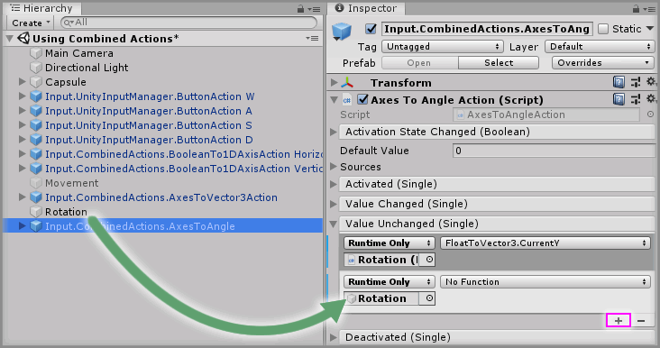

Select a function to perform when the `Value Changed` event is emitted. For this example, select the `Float To Vector3 -> DoTransform()` function (be sure to select `Static Parameters - DoTransform()` for this example).

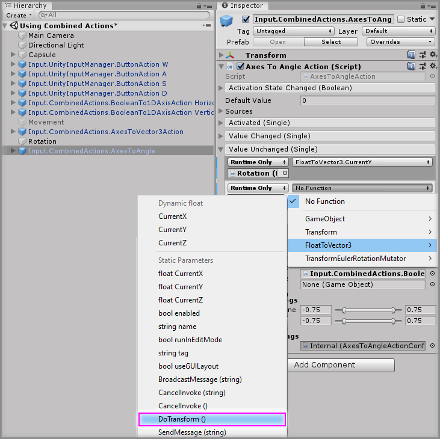

### Done

Play the Unity scene, you will notice that by pressing the keys you can rotate the GameObject to change the direction it is facing.

[Install the Tilia.Input.UnityInputManager.Unity]: https://github.com/ExtendRealityLtd/Tilia.Input.UnityInputManager/tree/master/Documentation/HowToGuides/Installation/README.md
[Install the Tilia.Input.CombinedActions.Unity]: ../Installation/README.md
[Unity]: https://unity3d.com/